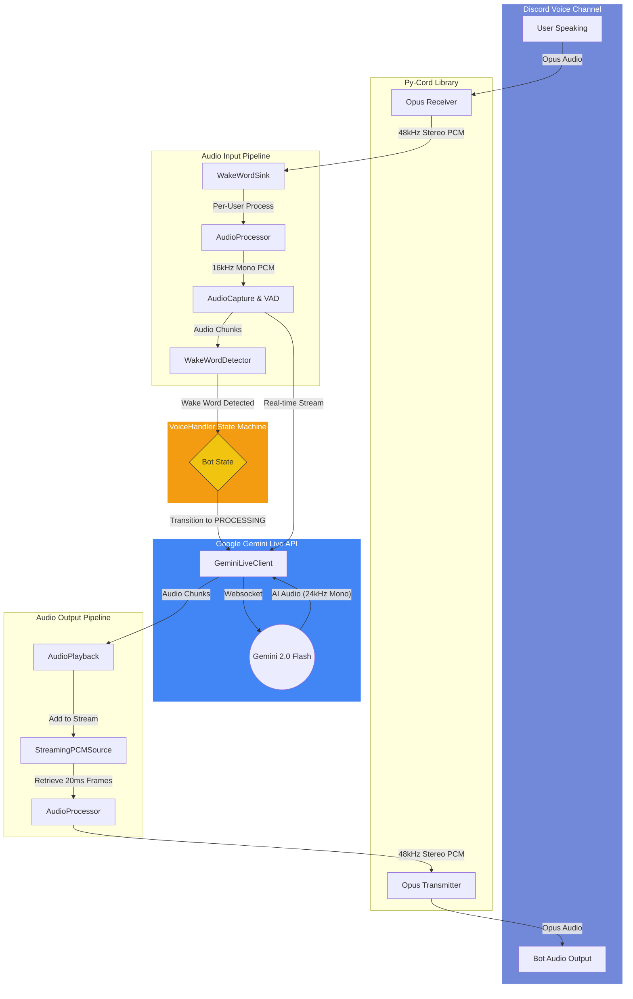

# Discord Live VC Bot: End-to-End Pipeline

This diagram illustrates the flow of audio data and control signals from the moment a user speaks in a Discord voice channel to the moment the bot responds with AI-generated audio.



### Text-Based Pipeline Diagram (ASCII)

```text
    [ DISCORD VOICE CHANNEL ]
      |                 ^
      | (Opus Audio)     | (Opus Audio)
      v                 |
    [ PY-CORD ] <-------|
      | (Decrypted 48kHz Stereo)
      v
    [ WAKE WORD SINK ] (Separates users)
      |
      v
    [ AUDIO PROCESSOR ] (Downsamples 48kHz -> 16kHz Mono)
      |
      v
    [ WAKE WORD DETECTOR ] (openwakeword - "Hey Jarvis")
      |
      +----- (DETECTED!) ----> [ VOICE HANDLER ] (Bot State Machine)
                                    |
                                    v (Start Streaming)
    [ AUDIO CAPTURE ] -------------+
      |                             |
      v (16kHz Mono Stream)         |
    [ GEMINI LIVE CLIENT ] <--------+
      |
      v (WebSocket Connection)
    [ GOOGLE GEMINI 2.0 AI ]
      |
      v (AI Returns 24kHz Mono Audio)
    [ GEMINI LIVE CLIENT ]
      |
      v (Audio Chunks)
    [ AUDIO PLAYBACK ] (Streams to Discord)
      |
      v (Upsamples 24kHz -> 48kHz Stereo)
    [ PY-CORD AUDIO OUTPUT ]
```


### Component Breakdown

1.  **Discord & Py-Cord**: Receives encrypted Opus packets, decrypts them into raw 48kHz stereo PCM.
2.  **WakeWordSink**: A custom Discord sink that separates audio by user to ensure the wake word can be detected even if multiple people are talking.
3.  **AudioProcessor**: Handles sampling rate conversion (48kHz <-> 16kHz/24kHz) and channel mixing (Stereo <-> Mono).
4.  **AudioCapture & VAD**: Buffers audio for detection and uses WebRTC VAD (Voice Activity Detection) to detect when a user stops speaking.
5.  **WakeWordDetector**: Uses `openwakeword` to monitor 16kHz mono audio for the specific wake phrase (e.g., "Hey Jarvis").
6.  **VoiceHandler**: The central "brain" or state machine. It coordinates when to start/stop listening and when to switch to responding.
7.  **GeminiLiveClient**: Manages the persistent WebSocket connection to Google's Gemini 2.0 Flash. It streams the user's speech up and receives the AI's response down in real-time.
8.  **StreamingPCMSource**: A custom Discord AudioSource that acts as a low-latency buffer, playing audio chunks from Gemini as they arrive rather than waiting for the full response.
